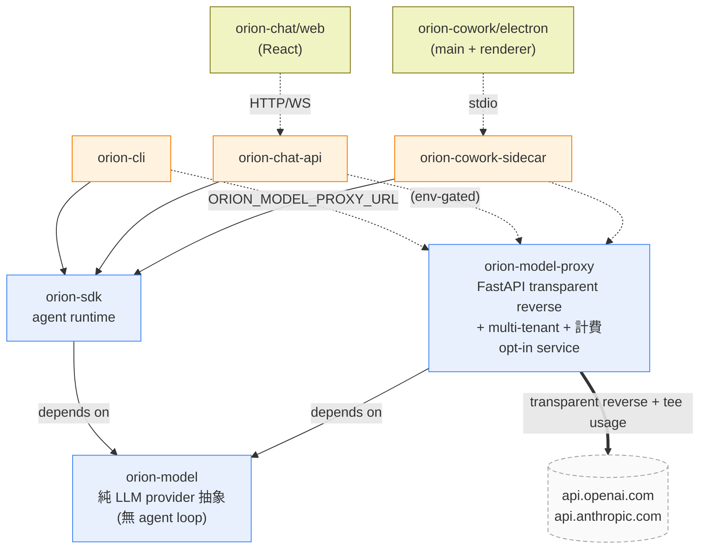

# Architecture

orion-agent 是 multi-LLM agent harness — 直接用 anthropic + openai + ollama 三個薄
SDK / HTTP client,**不**用第三方 agent framework。**uv workspace + npm workspaces 雙
monorepo**,拆 3 個 package(reusable libs)+ 3 個 app(可獨立交付)。

## 結構速覽

```
orion-agent/
├── packages/
│   ├── orion-model        純 LLM provider 抽象(Anthropic + OpenAI + Ollama)
│   ├── orion-sdk          Agent runtime(Conversation loop + tools + memory + ...)
│   └── orion-model-proxy  HTTP service:transparent reverse + multi-tenant + 計費(opt-in)
│
└── apps/
    ├── orion-cli          Terminal CLI(stdin / Typer,各 tenant 走自己的 sessions/)
    ├── orion-chat/
    │   ├── api/           FastAPI + WebSocket + JWT(multi-tenant 設計,Postgres-ready)
    │   └── web/           Vite + React 客戶端
    └── orion-cowork       Electron 桌機 app(透過 Python sidecar 用 SDK,SQLite 本機儲存)
```

## 依賴流



**Env gating**:host 用 `orion_model` 的 `AnthropicProvider` / `OpenAIProvider`,SDK init 時偵測 env:

- `ORION_MODEL_PROXY_URL` 有設 → SDK `base_url` 換成 proxy(透傳 + 計費)
- 沒設 → SDK 預設打 `api.{anthropic,openai}.com`

Wire format 永遠 = OpenAI / Anthropic 原生(跟外部 SDK 共用)。Ollama 本機 daemon,不經 proxy。

## 規則(由 import-linter 強制)

1. `orion-model` 只 import 標準庫 + `anthropic` + `openai` + `httpx` + `pydantic` + `structlog`
2. `orion-model-proxy` 可 import `orion-model` + `fastapi` + `uvicorn` + `sqlalchemy`,**不可** import `orion-sdk`(model layer 不認 agent loop)
3. `orion-sdk` 可 import `orion-model`,**不可** import `typer` / `fastapi` / `uvicorn`
4. App 層(cli / chat-api / sidecar)可 import sdk + model,**彼此不互相依賴**
5. `orion-chat/web` 跟 `orion-cowork/electron` 是 TS,不直接 import Python 程式,透過協定通訊

## 深入

| 想看... | 去 |
|---|---|
| 3 個 package 各做什麼、entrypoint 在哪 | [packages.md](./packages.md) |
| runtime 設定 / 資料散落哪幾個目錄 | [runtime-layout.md](./runtime-layout.md) |
| 重要設計取捨(為何不用 LangChain、為何 Cowork 不走 chat-api、為何 proxy 用 transparent reverse、...) | [design-decisions.md](./design-decisions.md) |

## 看完繼續

- 想知道某個 feature 怎麼運作 → [`../features/README.md`](../features/README.md)
- 想動手 → [`../guides/setup.md`](../guides/setup.md)
- 想看下一步方向 → [`../roadmap/README.md`](../roadmap/README.md)
