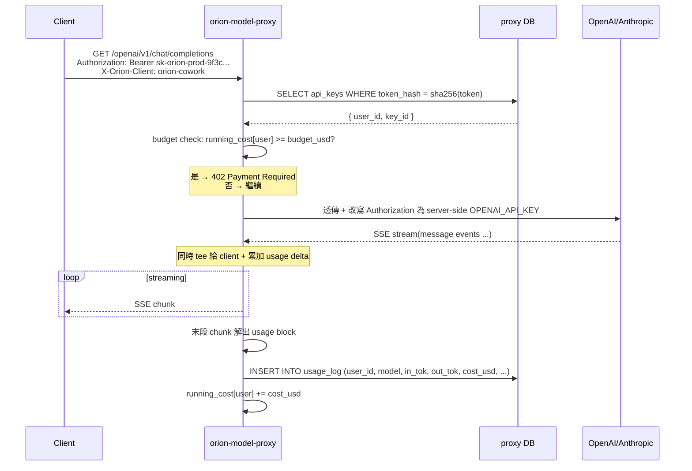

# Phase 32:Model Proxy multi-tenant + per-user cost tracking

## 速覽

- **預計時程**:3-4 天(實作)+ 0.5 天(整合測試 + 文件)
- **前置 Phase**:Phase 31-X(orion-model-proxy MVP — transparent reverse)、
  31-Q(per-session cost budget,Cowork-side)
- **觸發來源**:user 問「如何要建立使用者和 API-KEY 的機制,並且要計算使用者
  使用的費用」
- **狀態**:✅ 完成(Phase X.1-X.5 + legacy `ORION_MODEL_PROXY_KEY` server-side env 全面移除)

> **重要決定**(實作中收到 user feedback 後做的):Phase 31-X 用過的單一
> `ORION_MODEL_PROXY_KEY` server-side env mode 已**完全移除**。Phase 32 後 proxy
> 只剩 multi-tenant 一條路徑。客端 env name `ORION_MODEL_PROXY_KEY` 保留 — 但
> 內容語意從「跟 server 一樣的 shared secret」改成「admin 為這客端 user 個別
> 生成的 token(`sk-orion-<env>-...`)」。

## 1. 為何要做

Phase 31-X 的 proxy 是 **single-tenant** — 一個 `ORION_MODEL_PROXY_KEY` 給所有
client 共用,upstream API key 也是共用一份。對「個人 / 小團隊」場景夠,但下列
需求戳破:

- 一台 proxy 給團隊用 — 每人各自 token,離職 revoke 一人不動其他人
- 計費 — 老闆 / admin 想知道誰花了多少
- Budget cap — 不讓某 user 失控
- 多環境(prod / staging / test)key 區分
- 對外部 SDK(LangChain / aider / Cursor)透明 — 他們也算到正確 user

## 2. 設計決議(已對齊 user)

| 維度 | 選 |
|---|---|
| Token format | `sk-orion-<env>-<random_urlsafe_32>` |
| Auth lookup | DB row(sha256(token) → user_id),取代單 env compare |
| Budget enforcement | **Hard**:超 cap → 402 擋下一 request |
| 外部 SDK 計費 | Proxy 解 response body — **path A**(byte-for-byte 透傳 + tee 解析) |
| Admin UI | Server-rendered Jinja2(避免另一個 Vite build chain) |
| DB | 一份 schema 走兩種 backend:`ORION_PROXY_DB_URL` env 切 |
|     | dev / test → SQLite(`./proxy.db`) |
|     | prod → Postgres |

### 2.1 為什麼 path A(proxy 解 body)而不是 path B(client 自報)

Path B(client 自己解 cost 後 POST `/usage/report`)聽起來輕,但:

- **外部 SDK 不會自報** — LangChain / aider / curl 走 proxy 但不會多打一次
  `/usage/report`。計費歸零 = 對這些 client 不可信
- **Cowork 既有 cost tracking** 是 SDK 內邏輯(session-scoped budget),要重用
  得把 SDK-level cost 寫回 proxy DB,跨 process 同步反而麻煩
- **Path A 是 industry pattern**(LiteLLM / Helicone / OpenRouter 都這樣)

代價:proxy 不再是「啥都不懂的 byte pipe」,要懂每個 endpoint 的 response 結構。
這是 tradeoff,user 選了。

### 2.2 為什麼 hard budget 而不是 soft warning

User 選 hard cap。Pre-request 沒辦法精準預測這次會花多少,所以**只擋「已超 cap
的下次 request」** — 真實扣款最後一筆會略過 cap 一點點。這是 single-process
cost cache 的天然限制,要 100% 不超 cap 得 estimate 上限(顯著複雜化),不做。

## 3. DB Schema

```sql
-- 一份 schema,SQLAlchemy async,SQLite / Postgres 共用
CREATE TABLE users (
  id           TEXT PRIMARY KEY,            -- uuid
  email        TEXT UNIQUE NOT NULL,
  display_name TEXT,
  budget_usd   REAL,                        -- NULL = no cap
  created_at   INTEGER NOT NULL             -- epoch seconds
);

CREATE TABLE api_keys (
  id            TEXT PRIMARY KEY,           -- uuid
  user_id       TEXT NOT NULL REFERENCES users(id) ON DELETE CASCADE,
  token_hash    TEXT NOT NULL UNIQUE,       -- sha256(plaintext)
  token_prefix  TEXT NOT NULL,              -- "sk-orion-prod-9f3c" 給 user 在 admin 認自己 key
  label         TEXT,                       -- "MacBook Pro" / "CI" / ...
  created_at    INTEGER NOT NULL,
  last_used_at  INTEGER,
  revoked_at    INTEGER                     -- soft delete;NULL = active
);
CREATE INDEX idx_api_keys_token_hash ON api_keys(token_hash);
CREATE INDEX idx_api_keys_user_id ON api_keys(user_id);

CREATE TABLE usage_log (
  id                  INTEGER PRIMARY KEY,  -- AUTOINCREMENT / SERIAL
  user_id             TEXT NOT NULL,
  api_key_id          TEXT NOT NULL,
  provider            TEXT NOT NULL,        -- 'anthropic' / 'openai'
  model               TEXT NOT NULL,
  endpoint            TEXT NOT NULL,        -- '/openai/v1/chat/completions' 之類
  input_tokens        INTEGER,
  output_tokens       INTEGER,
  cache_read_tokens   INTEGER,
  cache_creation_tokens INTEGER,
  cost_usd            REAL NOT NULL,
  ts                  INTEGER NOT NULL,
  client_id           TEXT,                 -- 'orion-cowork' / 'orion-cli' / NULL(external SDK)
  request_id          TEXT                  -- caller trace id(optional)
);
CREATE INDEX idx_usage_user_ts ON usage_log(user_id, ts);
```

### 3.1 Migration

初始 phase:`Base.metadata.create_all()` 自動建表(idempotent)。加新 column 時
再上 alembic — 對齊 chat-api 已有的 pattern。

## 4. 流程圖



## 5. 模組分布

```
packages/orion-model-proxy/
├── pyproject.toml                                          + sqlalchemy + aiosqlite + asyncpg + jinja2
├── src/orion_model_proxy/
│   ├── server.py                                           ~ require_auth 改 DB lookup
│   ├── upstream_proxy.py                                   ~ tee response 給 usage_parser
│   ├── db.py                                               + engine + session factory(讀 ORION_PROXY_DB_URL)
│   ├── models.py                                           + User / ApiKey / UsageLog ORM
│   ├── auth.py                                             + sha256 lookup + in-memory key cache
│   ├── budget.py                                           + running_cost 計算 + cap check
│   ├── usage_parser.py                                     + chat/responses/embeddings/anthropic/audio/image
│   ├── admin_routes.py                                     + /admin/* REST + /admin/ui Jinja
│   └── templates/                                          + login.html / users.html / user_detail.html
└── tests/
    ├── test_auth_lookup.py
    ├── test_usage_parser.py
    ├── test_budget.py
    └── test_admin_api.py
```

## 6. Phasing

### Phase X.1 — DB + Auth + Admin REST(~1 天)

- `db.py` + `models.py`(SQLAlchemy async)
- `auth.py`:`require_auth` 改 DB-based + 5 min TTL cache
- `admin_routes.py`:
  - `POST /admin/users` — create user
  - `GET /admin/users` — list + 月用量 rollup
  - `DELETE /admin/users/{id}` — cascade
  - `POST /admin/users/{id}/keys` — gen new(回明文一次)
  - `DELETE /admin/keys/{id}` — soft revoke
  - `POST /admin/users/{id}/budget` — set cap
  - `GET /admin/users/{id}/usage?from=&to=` — date rollup
- Admin auth:`ORION_MODEL_PROXY_ADMIN_KEY` env(跟 user keys 分流)
- Unit tests:auth lookup hit/miss/revoked、admin CRUD round-trip

### Phase X.2 — Response 解析 + 計費(~1.5 天)

- `usage_parser.py`:per-endpoint dispatch
  ```
  /openai/v1/chat/completions    → parse_openai_chat       (usage 末 chunk)
  /openai/v1/responses           → parse_openai_responses  (usage 末 chunk)
  /openai/v1/embeddings          → parse_openai_embeddings (usage.total_tokens)
  /openai/v1/audio/transcriptions → 解 multipart duration  (request side)
  /openai/v1/audio/speech        → input char count        (request side)
  /openai/v1/images/generations  → n × pricing(size)      (request + response)
  /anthropic/v1/messages         → parse_anthropic_messages(message_delta 累加)
  /anthropic/v1/messages/count_tokens → no cost,log 但 cost=0
  其他 endpoint                  → log endpoint name + cost=0(unknown)
  ```
- `upstream_proxy.py` 改:`aiter_bytes()` 換成 tee — 一邊轉發 client、一邊送
  parser 累加。Stream 完 emit final usage event → DB insert
- Pricing 來源:`orion_model.catalog.get_pricing()` 既有(input/output/cache_read/
  cache_creation)
- Audio cost:`orion_model.stt_catalog.get_stt_pricing()` /
  `tts_catalog.get_tts_pricing()`
- Tests:
  - parse 各 endpoint fixture(`tests/fixtures/openai_chat.sse`、
    `anthropic_messages.sse`、`embeddings.json` 等真實 sample)
  - 算出 cost == 預期(對拍 catalog pricing 手算)

### Phase X.3 — Budget enforcement(~0.5 天)

- `budget.py`:`UserCostCache` 單 process,key = user_id,value = running USD,
  TTL 60s 強制重算
- `require_auth` 後加 `enforce_budget(user_id)`:
  ```python
  running = await running_cost_for_user(user_id)  # cache hit / DB fallback
  cap = user.budget_usd
  if cap is not None and running >= cap:
      raise HTTPException(402, "budget cap reached")
  ```
- Post-request:寫 `usage_log` 完後 `_user_cost_cache[user_id] += cost_usd`
- Tests:
  - cap 沒設 → 無限放行
  - cap 設了未達 → 放行
  - cap 達 / 超 → 402
  - 多 request 累加 → 超 cap 那筆**過了**(pre-request 還沒到),下一筆 402

### Phase X.4 — Admin Web UI(~1 天)

- Jinja2 + minimal CSS(Pico.css CDN,no build step)
- Pages:
  - `/admin/ui/` — login(Bearer admin key prompt)
  - `/admin/ui/users` — list table + 「+ New user」
  - `/admin/ui/users/{id}` — keys(generate / revoke)+ usage chart(7/30 day)+
    budget 設定 form
- Session via HttpOnly cookie + admin token sealed in cookie(no JS state)

### Phase X.5 — 整合測試 + regression(~0.5 天)

- e2e 跑通:
  1. admin REST create user → gen key → 拿到明文 token
  2. 用 OpenAI SDK 帶這 token 打 proxy `/openai/v1/chat/completions`
     (mock upstream:不打真 OpenAI,proxy → 自家 mock fastapi)
  3. SSE 結束後 — `usage_log` 有對應 row,cost_usd 對得上 catalog
  4. admin REST 查 user usage rollup 看得到
- Regression:orion-model / orion-sdk / orion-cli / orion-chat / cowork-sidecar
  全 test pass

## 7. 風險 + 緩解

| 風險 | 緩解 |
|---|---|
| SSE tee → 客端 latency 多一跳 byte | 用 `asyncio.Queue` + parser 在另一個 task,客端 forward 不等 parser |
| Parser 沒涵蓋的 endpoint | log endpoint name + cost=0,不擋 request;後續補解析 |
| DB 寫入慢拖慢 response | 寫 usage_log 非同步 fire-and-forget(loop.create_task)— request 不等寫完 |
| Bearer cache TTL 太長 → revoke 不立即生效 | 60s TTL + admin revoke 時主動 invalidate cache |
| 多 proxy instance 共享 budget cache | 先不做(prod 起步單 instance);未來 Redis |
| User 從 0 跳到 100% cap | 真實 last request 可能略超 cap — 文件明寫,users 可接受 |

## 8. 不做的事(out of scope)

- 多 organization / team(只到 flat users)
- OAuth login(admin token 已夠)
- Per-user routing(user A 走 gpt-5,user B 走 gpt-5-mini)— Phase 33 才討論
- Cache layer(prompt hash → cached response)— Phase 33
- Failover(429 → 切其他 provider)
- Multi-proxy instance HA / Redis-backed cache
- WebSocket / Realtime API 支援(現 proxy 也沒做)

## 9. 相關

- `packages/orion-model-proxy/`                        本 phase 主場
- `docs/features/model-proxy.md`                       MVP 文件(Phase X 完成後同步更新)
- `docs/roadmap/plans/31-phase30-followup/B-cowork-signing-update.md`
                                                        Cowork signing(獨立 phase,不依賴)
